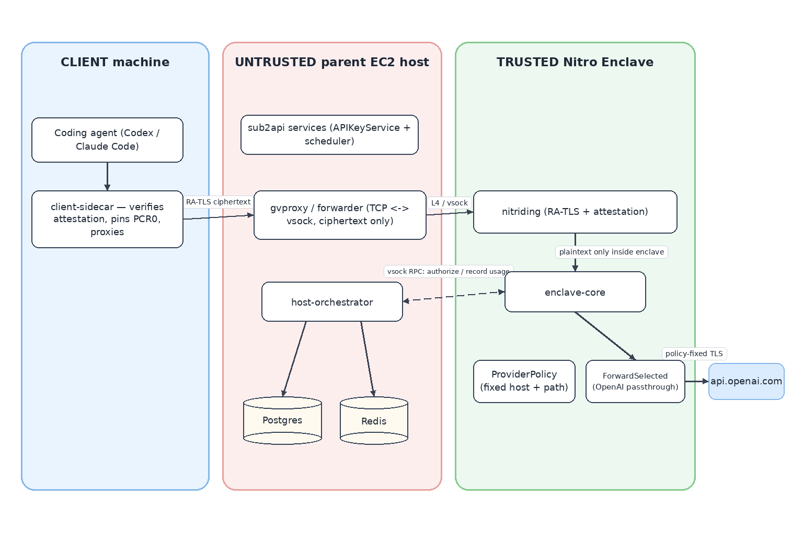

# Confidential LLM Router

**A hardened fork of [sub2api](https://github.com/Wei-Shaw/sub2api) that runs the LLM data plane inside an AWS Nitro Enclave — so a malicious router host cannot read, exfiltrate, or tamper with your prompts and responses.**

LLM API routers (gateways that multiplex coding agents like Claude Code / Codex onto upstream providers) sit directly on the plaintext path of every prompt, response, and tool call. The measurement study *"Your Agent Is Mine"* (arXiv:2604.08407) shows this is not hypothetical: a malicious router operator can passively scrape secrets from traffic (AC-2) or actively rewrite tool calls into remote code execution on the client (AC-1) — and names sub2api as the dominant template among vulnerable deployments.

This project makes the router itself an **attested trust boundary**. Client-facing TLS terminates *inside* a Nitro Enclave, the enclave forwards request bodies verbatim to a policy-pinned upstream, and a client-side sidecar verifies the enclave's attestation (PCR measurements + TLS-cert binding) and **fails closed** before sending any plaintext. The untrusted host keeps doing what it can safely do: authentication, account scheduling, and usage logging — reached over a narrow vsock RPC that never carries a request body.



## Security goals & threat model

The host (its OS, processes, and operator) is assumed **actively malicious**; it is trusted for availability only. AWS Nitro hardware is the trust root. The upstream provider (e.g. OpenAI) is assumed honest. PostgreSQL/Redis are untrusted metadata storage.

| Goal | Status | Mechanism |
|------|--------|-----------|
| ① Plaintext confidentiality | ✅ defended | TLS terminates in-enclave; host hop is ciphertext-only (verified by packet capture in e2e); vsock RPC carries no body |
| ② Execution integrity | ✅ defended | Nitro attestation: client pins PCR0/1/2 of a reproducibly built enclave image |
| ③ Provider-credential isolation | ⚠️ descoped (future work) | Upstream API keys stay plaintext on the host — acceptable for the self-hosted single-operator target, where the operator already owns those keys |
| ④ Transport tamper-resistance | ✅ defended | Faithful passthrough (no content rewriting) + attested end-to-end TLS; redirects refused; upstream host and path fixed by enclave-baked policy |

Against the four *Your-Agent-Is-Mine* attack classes, the live attack harness (`deploy/enclave/attack-harness.sh` + `backend/cmd/malicious-router`) shows **AC-1 (tool-call injection), AC-1.a (dependency typosquatting), AC-1.b (trigger-gated conditional delivery), and AC-2 (secret exfiltration) all succeed against a plaintext-access baseline router and are all blocked here** — the host never sees plaintext to scrape or rewrite, and conditional triggers never fire.

## Design: minimal TCB

Only the **data plane** lives in the enclave. Everything that merely *decides* (auth, scheduling) or *records* (usage) stays outside, which keeps the trusted code small enough to audit and rebuild reproducibly:

| Component | Where | What it does |
|-----------|-------|--------------|
| `backend/cmd/enclave-core` | **Nitro Enclave** ([nitriding](https://github.com/brave/nitriding-daemon) app) | In-enclave TLS termination, verbatim OpenAI Responses passthrough, SSE relay + usage extraction, enclave-owned upstream allowlist (`internal/confidential/policy.go`) |
| `backend/cmd/host-orchestrator` | Untrusted host | Real sub2api services (API-key auth, account selection, usage logging), reached via a length-prefixed JSON RPC over **vsock port 9001** |
| `backend/cmd/client-sidecar` | Client machine | Fetches the Nitro attestation document, verifies the AWS signature chain, **pins PCR0/1/2**, checks the enclave's ephemeral TLS cert is bound in `user_data`, then proxies — fails closed on any mismatch |

Supporting packages: `internal/confidential` (DTOs, provider policy, vsock RPC), `internal/enclave` (`ForwardSelected` passthrough), `internal/sidecar` (attestation `Verify`), `internal/orchestrator` (pure interface-based host service).

The load-bearing invariant — the enclave must never link the host service layer:

```bash
cd backend && go list -deps ./cmd/enclave-core | grep internal/service   # must be EMPTY
```

## Quick start

Requires a Nitro-Enclaves-capable EC2 instance with `nitro-cli`, the allocator reserving ≥2 vCPUs / 3072 MiB, Docker, and Go (version per `backend/go.mod`).

```bash
# 1. Host-plane prerequisites: PostgreSQL + Redis containers, and deploy/.env with
#    OPENAI_API_KEY, GATEWAY_API_KEY, OPENAI_MODEL, DATABASE_*/REDIS_*/JWT_SECRET
#    (deploy/.env is gitignored — never commit it)

# 2. Build the enclave image (prints fresh PCR0/1/2 — measurements change on every rebuild)
bash deploy/enclave/build-eif.sh

# 3. Bring up the host plane: host-orchestrator + gvproxy + run-enclave + TCP forwarder
bash deploy/enclave/run-host.sh

# 4. Full end-to-end smoke test: pins the current EIF's PCR0, asserts the enclave runs
#    non-debug (Flags NONE), sends a real OpenAI request through the attested sidecar,
#    and packet-captures the host hop to assert it is ciphertext-only
bash deploy/enclave/e2e-smoke.sh
```

Never run the enclave with `--debug-mode`: it zeroes the PCRs and makes attestation worthless (the sidecar rejects all-zero PCRs).

## Evaluation

- **Attack harness** — `deploy/enclave/attack-harness.sh`: all four *Your-Agent-Is-Mine* attack classes succeed against the plaintext baseline, all blocked against this router (see table above).
- **Performance** — `deploy/enclave/perf-eval.sh` (r7i, streaming, vs direct-to-OpenAI): one-time attestation handshake ≈ 0.1 s; **+28 ms median added latency** on a ~1,000 ms LLM call; time-to-first-token overhead within provider variance.
- **Reproducible build** — `deploy/enclave/verify-reproducible-build.sh`: the Dockerfile pins the base image by digest so independent rebuilds reproduce the published PCR0; `deploy/enclave/measurements.json` is the signed measurement manifest the sidecar trusts.

## Limitations (honest record)

- **Goal ③ descoped**: upstream provider keys are plaintext on the host. Fine when the operator owns them (self-hosted); mandatory work before any managed/multi-tenant deployment.
- **Upstream auth trusts the public CA set** — the enclave pins the upstream *hostname* (`api.openai.com`) and verifies its cert against the CA bundle baked into the measured image, but does **not** pin the upstream public key (SPKI). A compromised CA mis-issuing for the pinned hostname would be accepted. SPKI pinning is a known, deliberately deferred hardening (key-rotation self-DoS risk).
- **OpenAI Responses path only** in the confidential data plane. The enclave is a faithful passthrough by design: no cross-protocol conversion, tool rewriting, or websearch emulation — agents talk to their native provider.
- **Multi-hop (Tier-2) attestation is designed, not built**: chaining through another confidential router would require RA-TLS + PCR allowlisting of the next hop. The current policy supports first-party providers (Tier-1) only.
- **Availability is out of scope**: the malicious host can always refuse service; it just cannot read or tamper.
- Real billing/quota is not wired into the confidential path — the host logs usage telemetry only.

## Relationship to upstream sub2api

This is a fork of [Wei-Shaw/sub2api](https://github.com/Wei-Shaw/sub2api), a multi-provider AI API gateway (Anthropic / OpenAI / Gemini / Antigravity; Go backend + Vue 3 frontend). The full upstream gateway — management UI, multi-platform routing, scheduling, billing — is intact and documented in the upstream README; this fork adds the confidential data plane on top. The standard (non-confidential) gateway still runs via `cd backend && go run ./cmd/server`.

## License

[LGPL-3.0-or-later](LICENSE), same as upstream sub2api.
